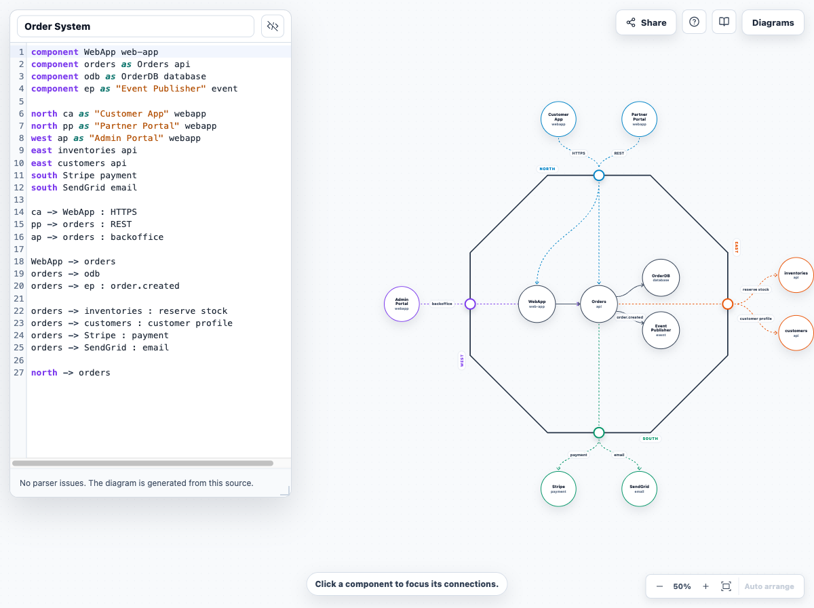

# Cell Architect

[](https://github.com/kanushka/cell-architect/actions/workflows/ci.yml)
[](https://www.npmjs.com/package/@kanushka/cell-diagram-react)
[](LICENSE)

Cell Architect is a browser-based workbench for drawing cell architecture diagrams from a small text DSL. It works like a split editor: write notation on the left, inspect the generated diagram on the right, and keep diagrams saved in the browser's local storage.

**[Try it live at cell-architect.web.app](https://cell-architect.web.app/)** — no account, no install, nothing leaves your browser.



## Features

- Text DSL for cell diagrams
- Split editor and diagram canvas
- Fullscreen diagram mode
- Light and dark diagram themes, with every color exposed as a CSS custom property for rebranding
- Local browser storage for diagrams
- Import and export `.cell` files
- Share a diagram as a self-contained link (the DSL is compressed into the URL, not uploaded)
- Internal, inbound, outbound, and gateway exposure dependencies
- Gateway circles on active cell boundaries
- Click a component to focus its connected links
- Temporary drag-to-arrange with Auto arrange reset
- Portable manual positions in exported `.cell` files and share links
- Convert a WSO2 cell-diagram model into Cell DSL

## Getting Started

This is a monorepo: the `@kanushka/cell-diagram-react` library lives in `packages/`, and the playground app that showcases it lives in `apps/`.

Install dependencies (installs all workspaces from the repo root):

```bash
npm install
```

Start the local playground dev server:

```bash
npm run dev
```

The app runs on:

```text
http://127.0.0.1:5173/
```

Build the library (`packages/cell-diagram-react`):

```bash
npm run build:lib
```

Build everything (library, then the playground app):

```bash
npm run build
```

Run tests across all workspaces:

```bash
npm test
```

Run lint:

```bash
npm run lint
```

### Releasing the library

The library is published to npm as [`@kanushka/cell-diagram-react`](https://www.npmjs.com/package/@kanushka/cell-diagram-react) via a tag-triggered GitHub Actions workflow (`.github/workflows/release.yml`):

1. Bump the version in `packages/cell-diagram-react/package.json`.
2. Commit the version bump.
3. Tag the commit `vX.Y.Z` (matching the new version) and push the tag:

   ```bash
   git tag v0.2.0
   git push origin v0.2.0
   ```

4. The `Release` workflow runs `npm ci`, `npm test`, `npm run build:lib`, then `npm publish -w @kanushka/cell-diagram-react --access public`.

This requires an `NPM_TOKEN` repository secret with publish rights, and the `@kanushka` npm scope must already exist (or the token's account must be authorized to create it).

## DSL Example

```cell
component WebApp web-app
component orders as Orders api
component odb as OrderDB database
component ep as "Event Publisher" event

north ca as "Customer App" webapp
north pp as "Partner Portal" webapp
west ap as "Admin Portal" webapp
east inventories api
east customers api
south Stripe payment
south SendGrid email

ca -> WebApp : HTTPS
pp -> orders : REST
ap -> orders : backoffice

WebApp -> orders
orders -> odb
orders -> ep : order.created

orders -> inventories : reserve stock
orders -> customers : customer profile
orders -> Stripe : payment
orders -> SendGrid : email

north -> orders
```

For full notation details, see the [DSL guide](docs/dsl-guide.md).

## Storage and privacy

Cell Architect has no backend. There is no account, no telemetry, and no diagram data ever leaves your machine:

- Diagrams live in the current browser's local storage, up to 10 at a time.
- Share links carry the compressed DSL in the URL fragment (`#s=…`), which browsers never send to a server.
- Export important diagrams as `.cell` files before clearing browser data or switching machines.

Opening a share link always asks before saving anything, and shows you the diagram source
first — following a link is not consent to have a diagram added to your library. Diagrams
are capped at 1000 nodes so that an oversized source cannot lock up the browser.

## Project Structure

```text
packages/cell-diagram-react   Publishable library (@kanushka/cell-diagram-react)
  src/parser                  Cell DSL parser
  src/compiler                Parser-to-diagram model validation
  src/renderer                React Flow layout and diagram rendering
  src/converter               WSO2 cell-diagram converter
  src/domain                  Shared cell diagram model types
  src/ui                      CellDiagram component

apps/playground               Browser workbench app that showcases the library
  src/app                     React app shell, editor, and styles
  src/storage                 Local document repository and default sample
  src/share                   Diagram import/export and sharing

docs                          DSL guide, requirements, and design history
  dsl-guide.md                Full notation reference
  requirements.md             What the project is and is not trying to be
  superpowers/                Design specs and implementation plans, kept as a record
.github/workflows             CI and release workflows
```

Every feature was designed before it was built, and those write-ups are kept in
[`docs/superpowers`](docs/superpowers/README.md). They explain why things are the way they
are, which is worth reading before proposing a change. They are historical records, though —
where a document and the code disagree, the code is correct.

See `packages/cell-diagram-react/README.md` for library install and usage instructions.

## Contributing

Contributions are welcome. See [CONTRIBUTING.md](CONTRIBUTING.md) for the development setup, the checks CI runs, and how changes are reviewed. By taking part you agree to the [Code of Conduct](CODE_OF_CONDUCT.md).

Release history is in [CHANGELOG.md](CHANGELOG.md).

## Security

To report a vulnerability, please follow the private process in [SECURITY.md](SECURITY.md) rather than opening a public issue.

## License

[MIT](LICENSE) &copy; Kanushka Gayan
