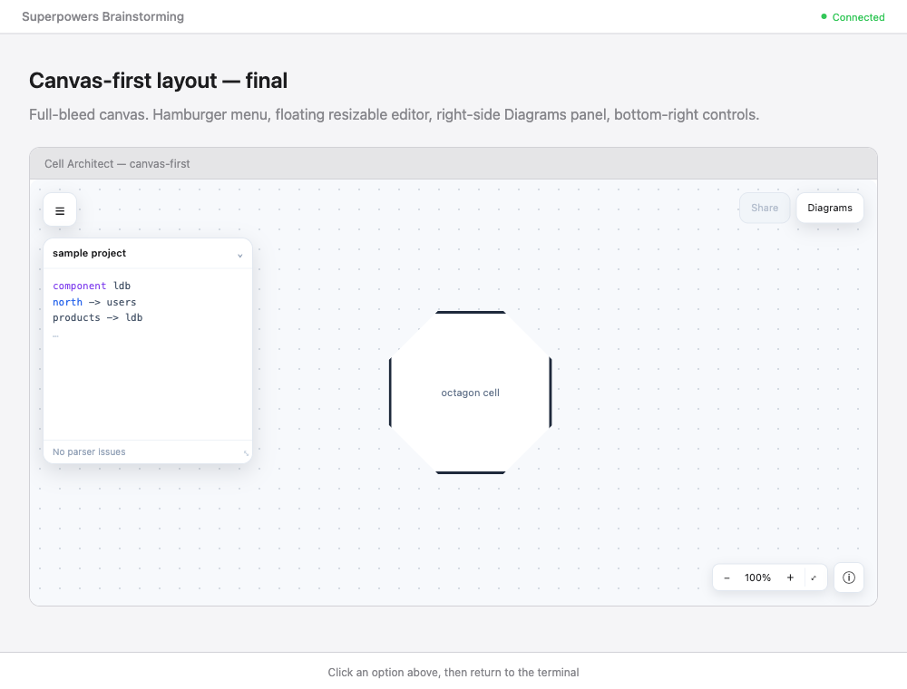

# Canvas-First Layout — Design Spec

**Date:** 2026-07-03
**Status:** Approved for planning
**Author:** gayanka@wso2.com (with Claude)

## Summary

Rework the Cell Architect workbench from a divided, boxed layout (sidebar + split
editor/canvas panes) into a **canvas-first, Excalidraw-style** layout: one
full-bleed diagram canvas fills the window, and every other piece of UI floats on
top as an absolutely-positioned overlay (panels, popovers, and modals).

The goal is a cleaner, more immersive editing surface where the diagram is the
primary object and the tooling gets out of the way.

## Target Layout

*(The header bar and "Connected / Click an option" strip in the screenshot belong
to the mockup preview tool, not to the app. Everything inside the framed canvas is
the design.)*

### Overlay map

| Region | Element | Behavior |
| --- | --- | --- |
| Top-left corner | **☰ Hamburger button** | Opens a dropdown menu: New, Import, Guide, Theme. Replaces the old top toolbar. |
| Left (below hamburger) | **Code editor** panel | Floating card. Collapsible (⌄) and **resizable**. Diagnostics line ("No parser issues" / errors) lives in its footer. |
| Top-right | **Share button** | Disabled. Hover tooltip: "Sharing is coming soon". Placeholder for a future feature. |
| Top-right | **Diagrams button** | No icon (text only). Toggles the right-side Diagrams panel. |
| Right side | **Diagrams panel** | Slides in. Lists saved diagrams; each row has a ⋯ menu → switch / duplicate / export / remove. |
| Bottom-right | **Zoom / fit cluster** | `−  100%  +  ⤢(fit)` grouped card. |
| Bottom-right | **ⓘ Info button** | Square control button. Opens a popover. |
| Center bottom (canvas) | **Focus hint** | "Click a component to focus its connections" (existing behavior, kept). |

### Info popover content

- Cell Architect is open source
- Link to the GitHub repo
- "Star the repo" ask
- Usage note: diagrams are stored in this browser only; up to 10 at a time
  (moves the current `storage-notice` copy here)

### Hamburger menu content

- New diagram
- Import `.cell`
- DSL Guide (opens the existing centered modal)
- Theme toggle (placeholder / future)

## Behavior Decisions

1. **Recenter on panel toggle.** The diagram always fits into the *free* canvas
   space, not the full window. When the Diagrams panel (right) or the editor
   (left) opens or closes, re-run React Flow's fit so the diagram recenters into
   the remaining visible area rather than being covered by an overlay. This is the
   core fix for the "overlay breaks centering" concern.

2. **Editor and Diagrams can be open together.** They sit on opposite sides
   (editor left, Diagrams right), so opening one does not close the other.

3. **Fullscreen** simply collapses the editor. The canvas is already full-bleed,
   so there is no separate fullscreen layout to maintain.

4. **Guide** remains a centered modal (unchanged from today).

## Architecture

### The centering fix (the one non-trivial piece)

React Flow's `fitView` fits the diagram to the size of its **own container**, not
the window. Today `.canvas-pane` is a flex sibling of the editor, so it is already
a sub-region of the screen and fit works naturally. Once the canvas becomes
full-bleed and panels float on top, a naive `fitView` would center the diagram
under the window's midpoint — and the floating editor (left) or Diagrams panel
(right) would cover part of it.

**Approach:** treat the overlay panels as *insets* and fit into the reduced
rectangle.

- Track which panels are open and their widths (editor width is user-resizable,
  Diagrams panel width is fixed) in `App` state.
- Pass those insets down to `DiagramCanvas`.
- Use React Flow's `fitView` padding to reserve the occupied edges. Verified: in
  this version (`@xyflow/system`) `fitViewOptions.padding` accepts per-side values
  `{ top, right, bottom, left }` in **px or %**. So we can pass the editor's exact
  pixel width as left padding when it is open, and the Diagrams panel width as
  right padding when it is open.
- Re-trigger fit whenever an inset changes: on panel open/close, on editor resize
  (debounced), and on window resize. Use the `useReactFlow().fitView()` imperative
  API inside a small effect keyed on the inset values.

This keeps the diagram visually centered in whatever space is actually free.

### Component structure

Refactor `App.tsx` from the current `document-rail` + `workbench` +
`split-editor` nesting into a single full-bleed shell that composes overlay
components. Extract focused components so `App` stays readable:

- `CanvasStage` — full-bleed wrapper hosting `DiagramCanvas`, owns the inset →
  fit wiring.
- `AppMenu` — the ☰ hamburger button + dropdown.
- `EditorPanel` — floating, collapsible, resizable wrapper around the existing
  `SourceEditor` + diagnostics.
- `DiagramsPanel` — right-side list with per-row ⋯ actions (reuses the existing
  duplicate/export/delete/switch logic from `App`).
- `CanvasControls` — bottom-right zoom/fit cluster + ⓘ info button.
- `InfoPopover` — the open-source / repo / usage popover.
- `ShareButton` — disabled button with tooltip.

State that stays in `App` (single source of truth): repository, active document,
which overlays are open, editor size. `DiagramCanvas` internals (React Flow nodes,
edges, focus highlighting) are unchanged except for the inset-aware fit.

### Styling

Rework `src/app/styles.css`: replace the flex split-pane rules with a positioned
overlay system. All overlays share a consistent floating-card treatment (white
background, subtle border, soft shadow, rounded corners) matching the mockup.
Ensure overlays sit above the canvas (`z-index`) and that the canvas layer still
receives pointer events for pan/zoom/click where panels are not covering it.

## Out of Scope

- The **Share** feature itself (button is a disabled placeholder only).
- Any change to the DSL, parser, compiler, or the diagram rendering/layout logic.
- Persisting editor size or open/closed panel state across sessions (can be a
  follow-up; default open on load is fine).
- Mobile / small-screen layout tuning beyond not breaking.

## Testing

- **Unit / component:** the existing `App.test.tsx` and `styles.test.ts` will need
  updates for the new structure. Add tests that:
  - the hamburger menu opens and exposes New / Import / Guide.
  - the Diagrams panel toggles and its row actions (duplicate/export/delete/
    switch) still call the repository functions.
  - the editor collapses and restores.
- **Manual / preview:** verify with the dev server that the diagram recenters when
  the editor or Diagrams panel opens/closes and after resizing the editor, and
  that no diagram content hides under a panel.

## Open Follow-ups (not blocking)

- Decide final Info popover copy and repo URL.
- Theme toggle implementation (currently a menu placeholder).
